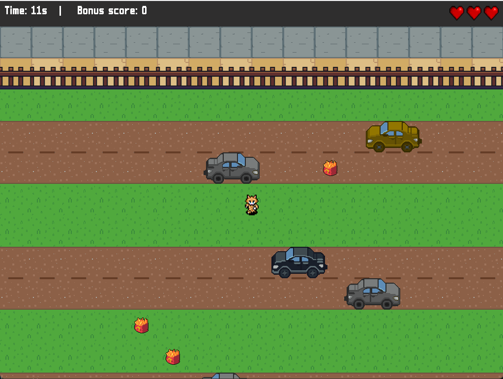
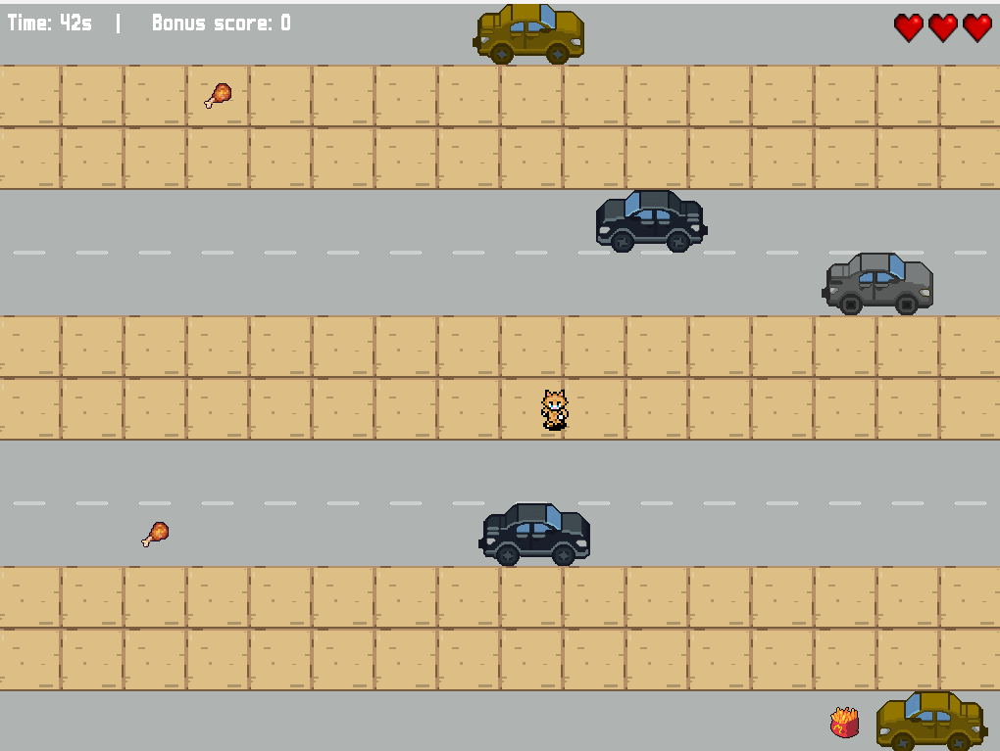
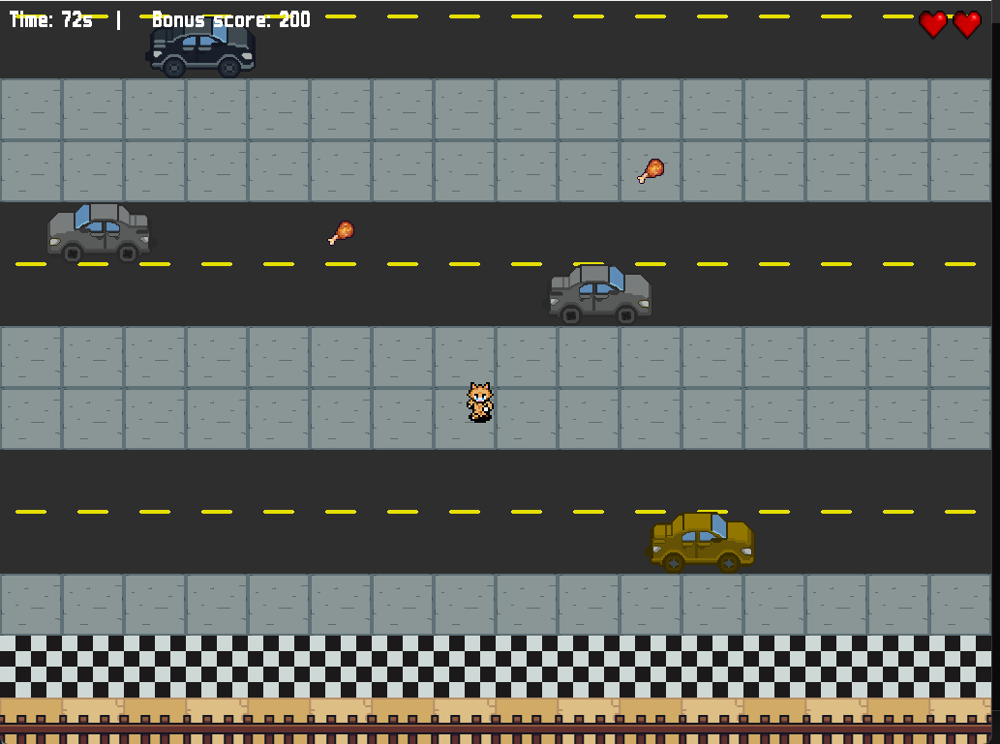
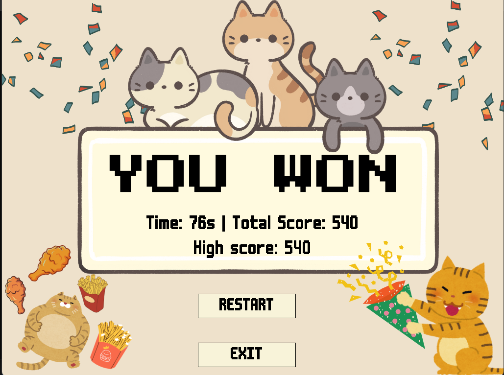
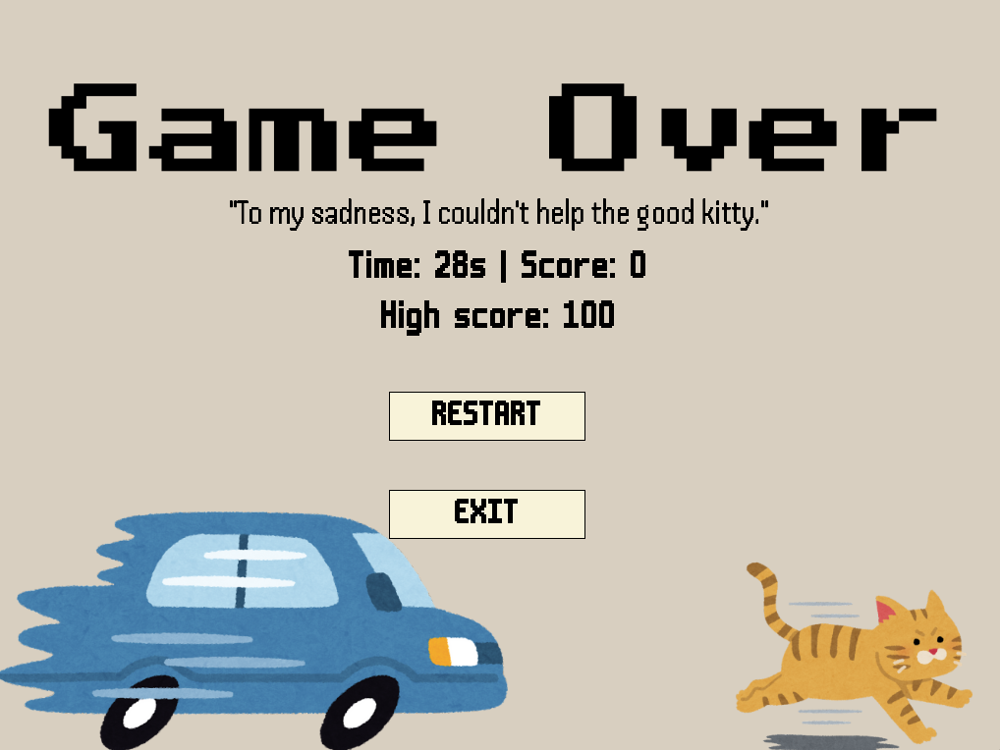

# Crossy Road Clone - Game 2D Top-down (SDL2 - Windows)
 
Một game 2D top-down nơi bạn điều khiển mèo cam băng qua đường, tránh xe cộ, thu thập đồ ăn, chạm tới vách đích. Game được viết bằng **SDL2** và chạy tốt trên **Windows**. Càng đi nhanh, điểm càng cao!

## Tính năng chính

- Cơ chế điều khiển bằng bàn phím
- Va chạm với xe cộ sẽ mất mạng ❤️
- Thu thập đồ ăn để tăng mạng và tăng điểm
- Chạm tới vạch đích sẽ chiến thắng
- Hết mạng sẽ thua
- Cơ chế hoạt họa sinh 
- Cơ chế lưu điểm cao, sẽ lưu điểm cao nhất của người chơi
- Cơ chế UI đơn giản, dễ sử dụng
- Hệ thống nhạc nền và hiệu ứng âm thanh sống động

## Hình ảnh minh họa

## Một số cơ chế và cách hoạt động
### Xử lí va chạm
#### Nguyên lí
- Dựa trên tọa độ hình chữ nhật (SDL_Rect) của hai vật thể, ta xét xem các góc hoặc cạnh của chúng có nằm trong vùng của nhau không.
#### Cách hoạt động
- Tính 4 cạnh của mỗi vật thể (left, right, top, bottom).
- Kiểm tra xem cạnh của object1 nằm trong vùng của object2, và ngược lại.
- Nếu có bất kỳ góc nào của hình này nằm trong hình kia → va chạm xảy ra.

- Có 3 tình huống kiểm tra:
  - Case 1: Object1 nhỏ hơn Object2 → kiểm tra các góc của object1 có nằm trong object2 không.
  - Case 2: Object2 nhỏ hơn Object1 → kiểm tra ngược lại.
  - Case 3: Hai object bằng nhau → so sánh tọa độ.
 
  ### Hệ thống bản đồ (Tile map)
  - Game sử dụng bản đồ tile-based để hiển thị nền, đường đi và vật thể.
   - loadMap() đọc dữ liệu bản đồ từ file .dat, lưu các tile vào ma trận.
   - loadTiles() nạp ảnh các tile (ví dụ: đường, vỉa hè,...) từ thư mục map/.
   - DrawMap() vẽ phần bản đồ hiển thị trên màn hình dựa vào vị trí camera (start_x, start_y).
 
## Các nguồn tham khảo
- Tài liệu lập trình nâng cao.
- Một số website:
 - https://phattrienphanmem123az.com/
 - https://lazyfoo.net/tutorials/SDL/
- Một số kênh Youtube: codergopher, The Builder, series video hướng dẫn: (https://www.youtube.com/watch?v=q1WzniyeGTU&list=PLR7NDiX0QsfQQ2iFXsXepwH46wf3D4Y4C)
- Một số website âm thanh hình ảnh: canva.com , itch.io, Freesound.org, ...
- Trong quá trình làm game, mình có gặp một số bug khó và do chưa có kinh nghiệm trong việc debug nên có sử dụng AI hỗ trợ.
